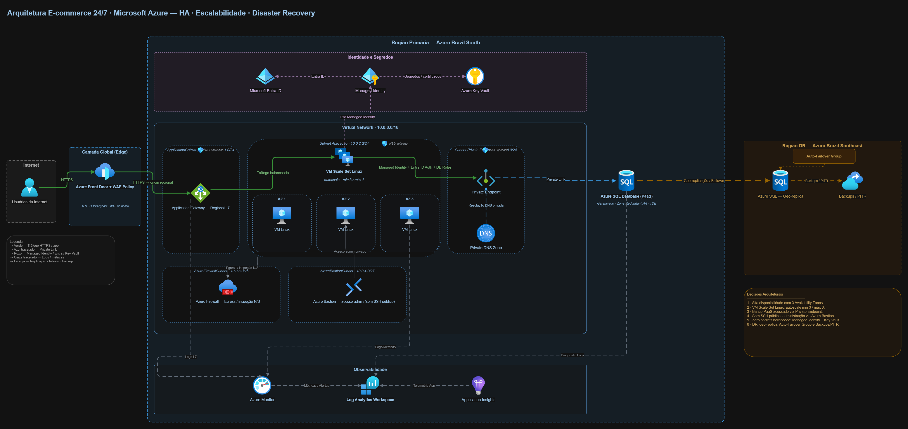

# Arquitetura E-commerce 24/7 em Microsoft Azure

## Descrição

Este repositório apresenta a arquitetura de solução em nuvem desenvolvida para o Desafio Final da pós-graduação em Arquitetura de Soluções.

A proposta consiste em uma arquitetura para uma aplicação de e-commerce com operação 24/7, projetada para alta disponibilidade, escalabilidade, segurança, observabilidade e recuperação de desastres utilizando serviços da Microsoft Azure.

A solução foi desenhada considerando múltiplas zonas de disponibilidade, balanceamento de carga, escalabilidade automática de máquinas virtuais Linux, banco de dados gerenciado PaaS, controle de acesso com identidade gerenciada, monitoramento centralizado e estratégia de Disaster Recovery em região secundária.

---

## Objetivo da Arquitetura

Projetar uma arquitetura em nuvem capaz de atender os seguintes requisitos:

* Disponibilidade contínua para uma aplicação de e-commerce.
* Distribuição de carga entre múltiplas instâncias de aplicação.
* Uso de múltiplas Availability Zones.
* Escalabilidade automática de VMs Linux.
* Banco de dados gerenciado como serviço PaaS.
* Comunicação segura entre aplicação e banco de dados.
* Controle de acesso baseado em identidade.
* Monitoramento, logs e telemetria.
* Estratégia de recuperação de desastres em região secundária.

---

## Cloud Provider Escolhido

**Microsoft Azure**

A escolha do Azure foi feita por oferecer serviços gerenciados adequados aos requisitos do desafio, incluindo recursos nativos para alta disponibilidade, segurança, escalabilidade, observabilidade e recuperação de desastres.

---

## Diagrama da Arquitetura



Arquivos disponíveis:

* [`arquitetura-ecommerce-azure.drawio`](diagramas/arquitetura-ecommerce-azure.drawio)
* [`arquitetura-ecommerce-azure.png`](diagramas/arquitetura-ecommerce-azure.png)
* [`arquitetura-ecommerce-azure.pdf`](diagramas/arquitetura-ecommerce-azure.pdf)

---

## Visão Geral da Solução

A arquitetura foi organizada em camadas para facilitar a leitura técnica e separar responsabilidades:

1. **Camada de Internet**

   * Representa os usuários externos acessando a aplicação.

2. **Camada Global / Edge**

   * Utiliza Azure Front Door com WAF Policy para entrada global, proteção na borda e encaminhamento HTTPS para o origin regional.

3. **Camada Regional**

   * Utiliza Application Gateway como ponto de entrada regional L7 para distribuir o tráfego para a camada de aplicação.

4. **Camada de Aplicação**

   * Utiliza VM Scale Set Linux distribuído em três Availability Zones, com autoscaling configurado para mínimo de 3 e máximo de 6 instâncias.

5. **Camada de Dados**

   * Utiliza Azure SQL Database como banco de dados gerenciado PaaS.
   * O acesso ao banco é realizado de forma privada por meio de Private Endpoint e Private Link.

6. **Camada de Identidade e Segredos**

   * Utiliza Microsoft Entra ID, Managed Identity e Azure Key Vault para controle de acesso, autenticação e gestão segura de segredos/certificados.

7. **Camada de Segurança de Rede**

   * Utiliza Network Security Groups aplicados às subnets, Azure Firewall, Azure Bastion e segmentação de rede por subnets específicas.

8. **Camada de Observabilidade**

   * Utiliza Azure Monitor, Log Analytics Workspace e Application Insights para coleta de métricas, logs e telemetria.

9. **Camada de Disaster Recovery**

   * Utiliza Azure SQL Geo-replica, Auto-Failover Group e Backups/PITR em região secundária.

---

## Componentes Utilizados

| Componente                    | Função na Arquitetura                                               |
| ----------------------------- | ------------------------------------------------------------------- |
| Azure Front Door + WAF Policy | Entrada global, TLS, roteamento Anycast/CDN e proteção WAF na borda |
| Application Gateway           | Balanceamento regional L7 para a aplicação                          |
| Virtual Network               | Isolamento lógico dos recursos de rede                              |
| ApplicationGatewaySubnet      | Subnet dedicada para o Application Gateway                          |
| Subnet Aplicação              | Subnet para o VM Scale Set Linux                                    |
| Subnet Private Endpoints      | Subnet dedicada para Private Endpoint                               |
| AzureBastionSubnet            | Subnet dedicada para acesso administrativo via Azure Bastion        |
| AzureFirewallSubnet           | Subnet dedicada para Azure Firewall                                 |
| VM Scale Set Linux            | Camada de aplicação escalável e distribuída em múltiplas zonas      |
| Availability Zones            | Alta disponibilidade entre zonas físicas distintas                  |
| Azure SQL Database            | Banco de dados gerenciado PaaS                                      |
| Private Endpoint              | Acesso privado ao Azure SQL Database                                |
| Private DNS Zone              | Resolução DNS privada para o endpoint do banco                      |
| Microsoft Entra ID            | Controle de identidade e autenticação                               |
| Managed Identity              | Identidade gerenciada para acesso seguro das VMs a serviços Azure   |
| Azure Key Vault               | Armazenamento seguro de segredos e certificados                     |
| Network Security Groups       | Controle de tráfego por subnet                                      |
| Azure Firewall                | Controle e inspeção de tráfego de saída e tráfego norte-sul         |
| Azure Bastion                 | Acesso administrativo seguro às VMs sem SSH público                 |
| Azure Monitor                 | Monitoramento de métricas e alertas                                 |
| Log Analytics Workspace       | Centralização de logs                                               |
| Application Insights          | Telemetria da aplicação                                             |
| Azure SQL Geo-replica         | Réplica do banco em região secundária                               |
| Auto-Failover Group           | Failover gerenciado entre banco primário e secundário               |
| Backups/PITR                  | Recuperação pontual de dados                                        |

---

## Fluxo de Tráfego

O fluxo principal da aplicação ocorre da seguinte forma:

1. Usuários acessam a aplicação via HTTPS pela Internet.
2. O tráfego entra pela camada global do Azure Front Door.
3. A WAF Policy aplicada ao Front Door protege a aplicação contra ameaças comuns de camada web.
4. O Azure Front Door encaminha o tráfego HTTPS para o Application Gateway configurado como origin regional.
5. O Application Gateway realiza o balanceamento regional L7 para o VM Scale Set Linux.
6. As instâncias Linux processam as requisições da aplicação.
7. A aplicação acessa o Azure SQL Database por meio de Private Endpoint e Private Link.
8. Logs, métricas e telemetria são enviados para Azure Monitor, Log Analytics Workspace e Application Insights.

---

## Alta Disponibilidade

A alta disponibilidade foi considerada em diferentes camadas da arquitetura:

* O Azure Front Door opera como serviço global de entrada.
* O Application Gateway atua como balanceador regional.
* O VM Scale Set Linux está distribuído em três Availability Zones.
* O Azure SQL Database foi representado como serviço PaaS com alta disponibilidade gerenciada.
* A arquitetura contempla região secundária para recuperação de desastres.
* O banco possui geo-replicação para Azure Brazil Southeast.

A distribuição das VMs em três Availability Zones reduz o impacto de falhas em uma zona específica e aumenta a resiliência da aplicação.

---

## Escalabilidade

A camada de aplicação utiliza **VM Scale Set Linux** com autoscaling.

Configuração considerada:

* Mínimo: **3 instâncias**
* Máximo: **6 instâncias**
* Imagem: **Linux**
* Distribuição: **Availability Zone 1, Availability Zone 2 e Availability Zone 3**

O autoscaling pode ser baseado em métricas como:

* CPU
* Memória
* Quantidade de requisições
* Métricas de aplicação

Essa abordagem permite que a solução aumente ou reduza capacidade de acordo com a demanda.

---

## Banco de Dados PaaS

O banco de dados escolhido foi o **Azure SQL Database**, representado como serviço PaaS gerenciado.

Principais características consideradas:

* Alta disponibilidade gerenciada.
* Backups automáticos.
* Point-in-Time Restore.
* Criptografia em repouso.
* Acesso privado via Private Endpoint.
* Integração com Microsoft Entra ID.
* Geo-replicação para região secundária.

O banco não foi representado dentro da Virtual Network, pois o Azure SQL Database é um serviço PaaS. O acesso privado ocorre por meio do Private Endpoint localizado dentro da VNet.

---

## Segurança e IAM

A arquitetura utiliza controles de segurança em múltiplas camadas.

### Identidade

* Microsoft Entra ID como provedor de identidade.
* Managed Identity para permitir que o VM Scale Set acesse serviços Azure sem uso de credenciais fixas.
* Autenticação no Azure SQL com Entra ID Auth.
* Permissões de leitura/escrita controladas por roles no banco de dados.

### Segredos

* Azure Key Vault para armazenamento de segredos, certificados e connection strings.
* Acesso ao Key Vault por meio de Managed Identity.
* Redução do uso de segredos hardcoded na aplicação.

### Rede

* Subnets segmentadas por função.
* Network Security Groups aplicados às subnets.
* Azure Firewall para controle e inspeção de tráfego.
* Azure Bastion para acesso administrativo seguro.
* Ausência de SSH público para administração das VMs.
* Acesso privado ao Azure SQL Database via Private Endpoint.

---

## Monitoramento e Observabilidade

A solução contempla monitoramento centralizado utilizando:

* Azure Monitor
* Log Analytics Workspace
* Application Insights

Fontes de dados observadas:

* Application Gateway
* VM Scale Set Linux
* Azure SQL Database
* Camada de aplicação
* Logs de diagnóstico
* Métricas de infraestrutura

Exemplos de alertas recomendados:

* Alta utilização de CPU nas VMs.
* Falha de health probe no Application Gateway.
* Aumento de erros HTTP 5xx.
* Latência elevada na aplicação.
* Falhas de conexão com o banco de dados.
* Consumo elevado de DTU/vCore no Azure SQL.
* Eventos de failover no banco.

---

## Disaster Recovery

A estratégia de recuperação de desastres utiliza uma região secundária:

* Região primária: **Azure Brazil South**
* Região secundária: **Azure Brazil Southeast**

Componentes considerados:

* Azure SQL Geo-replica
* Auto-Failover Group
* Backups automáticos
* Point-in-Time Restore

Em caso de falha crítica na região primária, o banco pode ser redirecionado para a réplica na região secundária por meio do Auto-Failover Group.

A estratégia permite continuidade operacional com menor impacto para a aplicação e reduz o risco de perda de dados.

---

## Decisões Arquiteturais

As principais decisões arquiteturais foram:

1. Uso de Microsoft Azure como provedor cloud.
2. Entrada global com Azure Front Door e WAF Policy.
3. Balanceamento regional com Application Gateway.
4. Alta disponibilidade com três Availability Zones.
5. VM Scale Set Linux com autoscale mínimo 3 e máximo 6.
6. Banco PaaS com Azure SQL Database.
7. Acesso privado ao banco via Private Endpoint.
8. Identidade gerenciada com Managed Identity.
9. Segredos centralizados no Azure Key Vault.
10. Monitoramento com Azure Monitor, Log Analytics e Application Insights.
11. Disaster Recovery com geo-replicação, Auto-Failover Group e Backups/PITR.

---

## Requisitos Atendidos

| Requisito do Desafio                      | Atendimento na Arquitetura                                |
| ----------------------------------------- | --------------------------------------------------------- |
| Uso de múltiplas zonas de disponibilidade | VM Scale Set distribuído em AZ 1, AZ 2 e AZ 3             |
| Balanceamento de carga                    | Azure Front Door e Application Gateway                    |
| Escalonamento automático                  | VM Scale Set Linux com autoscale min 3 / max 6            |
| Uso de imagem Linux                       | VMs Linux no VM Scale Set                                 |
| Banco de dados gerenciado PaaS            | Azure SQL Database                                        |
| Alta disponibilidade do banco             | Azure SQL gerenciado com HA e geo-replicação              |
| IAM para acesso ao banco                  | Managed Identity + Entra ID Auth + DB Roles               |
| Segurança de rede                         | NSG, Azure Firewall, Bastion, Private Endpoint            |
| Monitoramento e logs                      | Azure Monitor, Log Analytics e Application Insights       |
| Recuperação de desastres                  | Azure SQL Geo-replica, Auto-Failover Group e Backups/PITR |

---

## Estrutura do Repositório

```text
desafio-final-arquitetura-azure-ecommerce/
│
├── README.md
│
├── diagramas/
│   ├── arquitetura-ecommerce-azure.drawio
│   ├── arquitetura-ecommerce-azure.png
│   └── arquitetura-ecommerce-azure.pdf
│
└── docs/
    ├── relatorio-arquitetura.md
    ├── plano-implantacao.md
    ├── seguranca-iam.md
    ├── monitoramento.md
    └── disaster-recovery.md
```

---

## Documentação Complementar

A documentação complementar da arquitetura está disponível na pasta `docs/`:

* [`relatorio-arquitetura.md`](docs/relatorio-arquitetura.md)
* [`plano-implantacao.md`](docs/plano-implantacao.md)
* [`seguranca-iam.md`](docs/seguranca-iam.md)
* [`monitoramento.md`](docs/monitoramento.md)
* [`disaster-recovery.md`](docs/disaster-recovery.md)

---

## Entregáveis

Este repositório contém:

* Diagrama da arquitetura em formato editável Draw.io.
* Diagrama exportado em PNG.
* Diagrama exportado em PDF.
* README explicativo da solução.
* Documentação complementar sobre arquitetura, implantação, segurança, monitoramento e recuperação de desastres.

---

## Observação

Esta entrega apresenta uma proposta arquitetural para o cenário descrito no desafio. O foco está no desenho da solução, justificativa dos componentes e documentação da arquitetura em nuvem.
